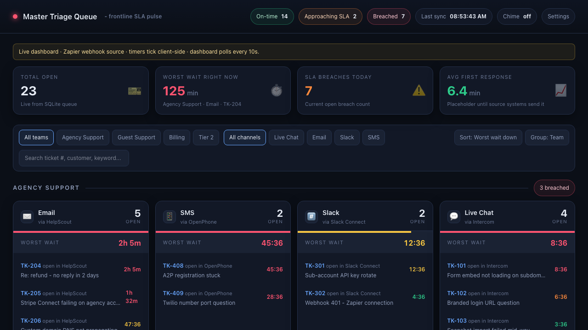
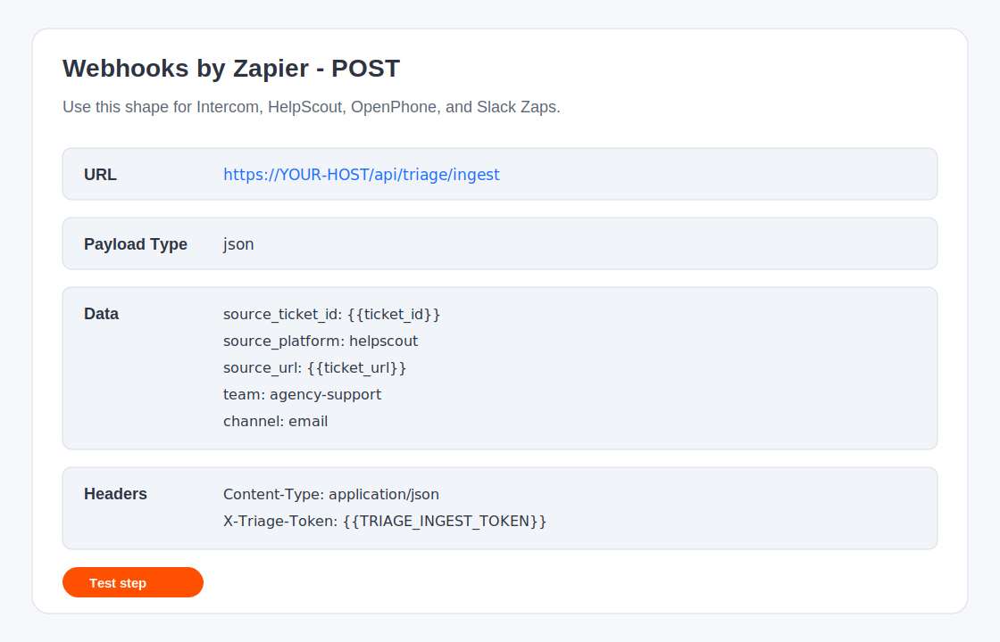

# HLPT Triage Queue Handoff

This is the one-file handoff for deploying the HLPT Master Triage Queue from the public GitHub repo: https://github.com/Lead2Legacy/hlpt-triage-queue

## 1. Manus-ready prompt

Copy and paste this block into Manus:

    Clone https://github.com/Lead2Legacy/hlpt-triage-queue and deploy it as a long-lived Node service.
    Use Node 20 or newer.
    Expose port 3000.
    Set one environment variable: TRIAGE_INGEST_TOKEN. Generate it with: openssl rand -hex 32
    Keep DATABASE_PATH unset unless the host needs a custom persistent path; the app defaults to ./data.db.
    Run these commands from the repo root:
    npm install
    npm run build
    npm start
    Persist the repo working directory or at least data.db so tickets and SLA settings survive restarts.
    After start, verify / loads, /settings loads, and POST /api/triage/ingest accepts a request with the X-Triage-Token header.
    Do not add Prisma, NextAuth, Supabase, Neon, Upstash, Vercel KV, or any external service.

## 2. What you'll have when this is done

You will have a single dark-mode SLA dashboard that groups open support tickets by team and channel, shows worst wait time live, colors each queue by SLA band, and lets a rep click straight back to the source ticket. A `/settings` page lets the team tune SLA minutes by team and channel without redeploying.

## 3. Step-by-step Manus deploy

1. Open Manus and create a new app from the GitHub repo: https://github.com/Lead2Legacy/hlpt-triage-queue
2. Set runtime to Node and expose port `3000`.
3. Generate the ingest token locally or in Manus shell: `openssl rand -hex 32`.
4. Set env var `TRIAGE_INGEST_TOKEN` to that generated value.
5. Leave `DATABASE_PATH` unset unless Manus asks for a persistent file path. Default is `./data.db`.
6. Build command: `npm install && npm run build`.
7. Start command: `npm start`.
8. After Manus gives you a URL, open `https://YOUR-HOST/` and `https://YOUR-HOST/settings`.
9. Send the token only to the Zapier owner. Do not paste it into the dashboard.

Local proof commands:

    git clone https://github.com/Lead2Legacy/hlpt-triage-queue.git
    cd hlpt-triage-queue
    cp .env.example .env
    npm install
    npm run build
    TRIAGE_INGEST_TOKEN=local-dev-token PORT=3000 npm start

## 4. Zapier wiring

Webhook URL format:

    https://YOUR-HOST/api/triage/ingest

Use Zapier action: Webhooks by Zapier -> POST.

Required headers:

- `Content-Type: application/json`
- `X-Triage-Token: YOUR_TRIAGE_INGEST_TOKEN`

Payload schema:

- `source_ticket_id`: unique id from the source system
- `source_platform`: `intercom`, `helpscout`, `openphone`, `slack`, or another source key
- `source_url`: permanent deep link back to the source ticket
- `team`: `agency-support`, `guest-support`, `billing`, or your own team key
- `channel`: `live-chat`, `email`, `sms`, or `slack`
- `summary`: one-line ticket preview
- `customer`: name, email, or phone number
- `opened_at`: optional milliseconds since epoch. If omitted, the app uses server time.

Worked examples:

Intercom live chat:
    { "source_ticket_id": "{{conversation_id}}", "source_platform": "intercom", "source_url": "{{conversation_url}}", "team": "agency-support", "channel": "live-chat", "summary": "{{conversation_title}}", "customer": "{{user_email}}" }

HelpScout email:
    { "source_ticket_id": "{{conversation_number}}", "source_platform": "helpscout", "source_url": "{{conversation_url}}", "team": "agency-support", "channel": "email", "summary": "{{subject}}", "customer": "{{customer_email}}" }

OpenPhone SMS:
    { "source_ticket_id": "{{conversation_id}}", "source_platform": "openphone", "source_url": "{{conversation_url}}", "team": "guest-support", "channel": "sms", "summary": "{{message_body}}", "customer": "{{phone_number}}" }

Slack Connect:
    { "source_ticket_id": "{{channel_id}}-{{message_ts}}", "source_platform": "slack", "source_url": "{{message_permalink}}", "team": "agency-support", "channel": "slack", "summary": "{{message_text}}", "customer": "{{user_name}}" }

Resolve tickets when the source closes:
    POST https://YOUR-HOST/api/triage/resolve
    Header: X-Triage-Token: YOUR_TRIAGE_INGEST_TOKEN
    Body: { "source_ticket_id": "TK-204", "source_platform": "helpscout" }

## 5. Tuning SLA thresholds

Use the admin UI first: open `https://YOUR-HOST/settings`, edit minutes by team and channel, then click Save thresholds. The dashboard picks up new values on the next 10-second poll.

API option:
    PATCH https://YOUR-HOST/api/triage/sla
    Content-Type: application/json
    Body: { "sla": [{ "team": "agency-support", "channel": "email", "sla_minutes": 45 }] }

Default fallback rows use `team: "default"`. Team-specific rows override the default channel value.

## 6. Adding auth later

Auth is intentionally not installed in v1. Keep Zapier token auth separate from dashboard auth.

Shared password recipe:
    Add DASHBOARD_PASSWORD to env. Build a small login page that sets an httpOnly signed cookie. In lib/auth.ts, check that cookie inside requireDashboardUser().

Google OAuth via NextAuth recipe:
    Only after HLPT chooses this route, install NextAuth with npm install next-auth. Configure GoogleProvider for the HLPT Workspace OAuth client. In lib/auth.ts, call auth() and reject missing sessions. Do not protect /api/triage/ingest with Google login; keep X-Triage-Token.

Reverse-proxy auth recipe:
    Put the app behind Cloudflare Access, Okta, Tailscale, or an internal proxy. Require login at the proxy. Pass a trusted header such as X-Forwarded-Email and check it in lib/auth.ts.

## 7. Troubleshooting

- Webhook returns 401: Zapier is missing `X-Triage-Token` or the value does not match `TRIAGE_INGEST_TOKEN`.
- Dashboard not updating: wait one poll cycle, then check `GET /api/triage/state` for the ticket.
- DB locked: make sure only one app process writes to the same `data.db` file.
- Port in use: stop the other process or set `PORT=3000` only for this service.
- Fresh-clone build failure: delete `node_modules`, rerun `npm install`, then `npm run build`.
- Manus container restart loses data: persist the working directory or mount `data.db` on durable storage.

## 8. Where to ask for help

Internal owner: Phil Short / HLPT.
GitHub Issues: https://github.com/Lead2Legacy/hlpt-triage-queue/issues
Repo: https://github.com/Lead2Legacy/hlpt-triage-queue

